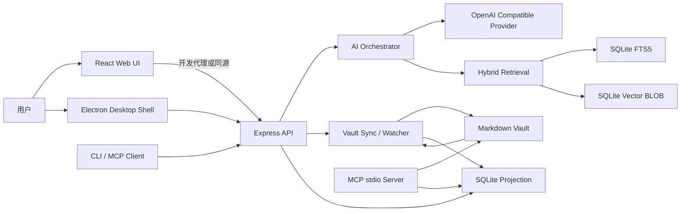
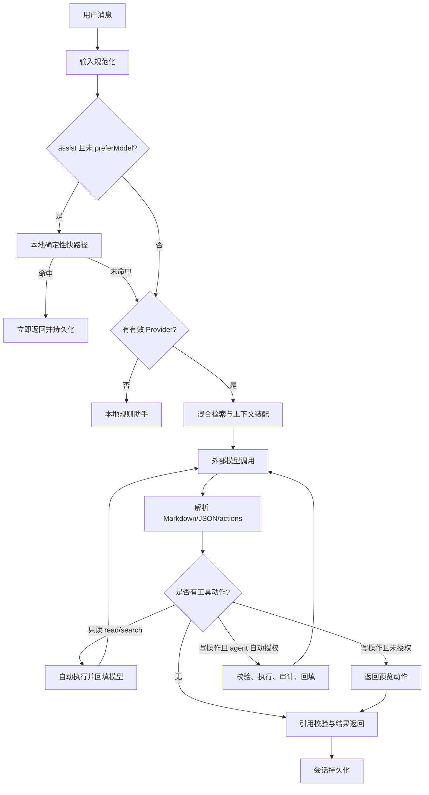
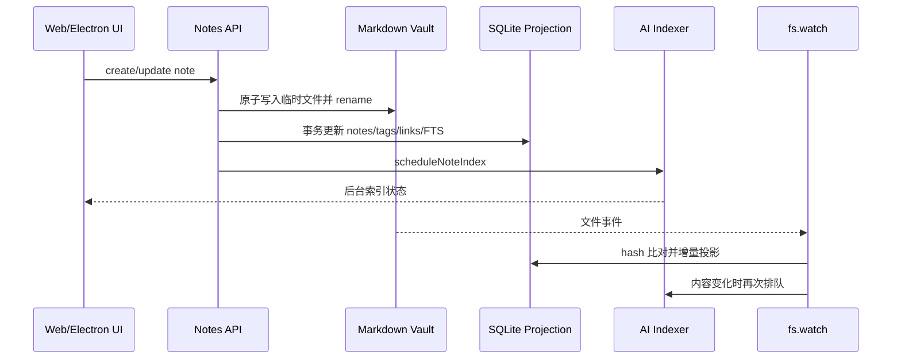
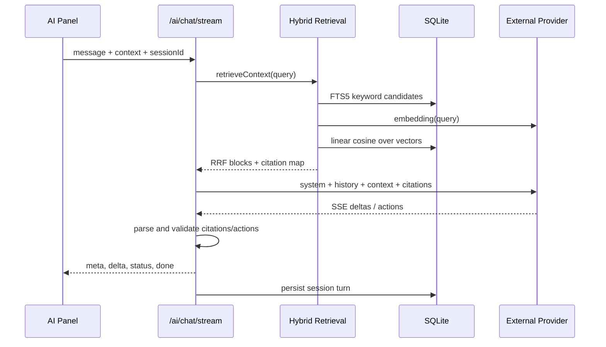

# Lattice AI 系统全面技术分析与开发报告

**分析日期：** 2026-09-29  
**分析对象：** `D:\source\Item\init\FCNode\lattice` 当前工作树  
**系统版本：** `0.1.1`  
**报告性质：** 基于当前源码、数据库迁移、测试和构建结果的开发技术报告

## 1. 执行摘要

Lattice 是一个本地优先的 Markdown 双链知识库应用。AI 系统并不是独立的聊天机器人，而是建立在 Vault 文件真源、SQLite 投影、全文检索、可选语义索引和受控文件操作之上的 AI 应用层。

当前 AI 能力已经覆盖：

- 本地规则快路径和无模型可用的离线助手模式；
- OpenAI 兼容接口的多模型配置、连通性测试、非流式和 SSE 流式调用；
- FTS5 trigram 关键词检索与 embedding 向量检索的混合 RAG；
- 会话持久化、引用编号校验、相关笔记和标签建议；
- 编辑器写作助手、每日摘要和 CLI；
- assist 模式的确认式文件操作与 agent 模式的多轮工具循环；
- MCP stdio Server，为外部 Agent 提供笔记读写工具；
- Electron 桌面封装、本地端口后端、Vault 选择和安全 IPC。

系统的主要架构优点是数据可恢复、模型可选、模块边界清晰、文件路径校验较完整，适合单用户本地知识库场景。主要工程风险集中在 AI 编排的边界条件、后台索引失败恢复、凭据保护、MCP 写入授权和缺乏生产级观测指标。当前测试通过不代表这些路径已经全部被覆盖。

## 2. 分析范围与方法

本报告检查了以下内容：

- 根目录、`server/`、`web/`、`desktop/`、`scripts/` 的包配置和启动脚本；
- Express 入口、中间件、路由、AI 模块、Vault 同步和数据库迁移；
- React AI 面板、模型中心、SSE 客户端和 Electron 主进程/预加载脚本；
- 服务端 97 项测试、前端测试、MCP E2E 和前端生产构建；
- 当前源码中的安全边界、异常处理、性能复杂度和持久化策略。

结论按三类表述：

1. **已实现事实**：可从当前代码或测试直接确认。
2. **现状判断**：根据实现方式推断的系统行为和工程影响。
3. **后续建议**：尚未实现的目标，不应视为当前能力。

## 3. 系统概述

### 3.1 产品定位

系统面向个人或单工作区用户，核心目标是让用户以 Markdown 文件管理知识，并在本地界面中完成：

- 笔记编辑、预览、双链、标签和关系图谱；
- 全文搜索、文件夹组织和 Canvas 白板；
- 使用外部模型进行知识问答、写作和文件整理；
- 通过 MCP 或 CLI 将知识库暴露给外部 Agent。

默认情况下，笔记内容、SQLite 数据库和会话数据都在本机。只有用户配置了外部模型后，对话内容、检索到的笔记分块或 embedding 才会离开本机。

### 3.2 当前架构基线

### 3.3 核心设计原则

| 原则 | 当前实现 | 价值 | 代价 |
| --- | --- | --- | --- |
| Markdown 真源 | Vault 文件保存正文，SQLite 可重建 | 数据可迁移、可被外部编辑 | 文件和数据库存在短暂一致性窗口 |
| 本地优先 | 无模型时使用本地规则回复，服务端绑定回环地址 | 离线可用、隐私边界清楚 | 本地模式的理解能力有限 |
| 零原生数据库依赖 | 使用 Node 内置 `node:sqlite` | Windows 安装和打包简单 | 依赖较新的 Node/Electron 运行时 |
| 模型适配层 | OpenAI Chat Completions 和 Embeddings 兼容接口 | 服务商替换成本低 | 不同厂商的流式/错误协议仍可能不完全一致 |
| 受控写入 | preview、plan hash、角色校验、审计日志 | 降低 AI 误操作风险 | 多文件操作失败时不能整体回滚 |
| 单进程后台任务 | SQLite 持久化状态，进程内执行 | 适合单机，部署简单 | 不适合高并发或多实例横向扩展 |

## 4. 技术架构

### 4.1 物理分层

| 层级 | 技术 | 主要职责 |
| --- | --- | --- |
| 表现层 | React 18、Vite 5 | 编辑器、AI 面板、模型管理、关系图谱和设置 |
| API 层 | Express 5、Zod | HTTP 路由、输入校验、错误契约、SSE |
| AI 编排层 | `ai.service.js` | 快路径、上下文组装、模型调用、工具循环、结果解析 |
| Provider 层 | `ai.provider.js` | Endpoint 规范化、认证头、超时、取消、SSE、Embedding |
| 检索层 | `ai.retrieval.js`、`ai.embeddings.js` | 关键词召回、向量召回、RRF 融合、引用校验 |
| 索引层 | `ai.indexer.js`、`lib/jobs.js` | 增量分块、embedding、后台任务和状态持久化 |
| 业务域层 | notes、folders、links、tags、search、graph、canvas | 知识库实体及其派生关系 |
| 同步层 | `vault/sync.js`、`vault/watcher.js` | 磁盘与 SQLite 投影的增量同步 |
| 数据层 | SQLite WAL、SQL migrations | 事务、FTS5、会话、索引、任务和配置 |
| 桌面层 | Electron 44 | 进程管理、Vault 选择、本地后端、IPC 和外部文件 |
| 外部集成 | MCP stdio、CLI | 面向 Agent 的工具调用和自动化入口 |

### 4.2 服务启动机制

服务端 `server/src/index.js` 的启动顺序为：

1. 解析并校验环境变量，非法配置立即退出；
2. 打开 SQLite，设置 WAL、外键、同步级别和 busy timeout；
3. 执行带 SHA-256 校验的版本化迁移；
4. 恢复数据库中上次未完成的后台任务；
5. 对 Vault 执行一次 full reconcile；
6. 启动文件监听器和增量事件发布；
7. 创建 Express 应用并监听 HTTP；
8. 启动每日摘要调度器；
9. 注册优雅停机、异常和数据库关闭逻辑。

Electron 模式把 Express 直接嵌入主进程，选择可用的本地端口，设置 `DB_FILE`、`VAULT_DIR` 和 `WEB_DIST_DIR` 后动态加载服务端模块，再轮询 `/ready` 确认后端就绪。渲染进程使用 `contextIsolation: true`、`nodeIntegration: false` 和 `sandbox: true`。

### 4.3 Express 安全边界

中间件顺序为：请求上下文、访问日志、安全响应头、CORS、JSON 解析、健康探针、业务路由、静态资源、404 和全局错误处理。

当前安全措施包括：

- Zod 对主要 API 输入做结构、数量和长度校验；
- `X-Content-Type-Options`、`X-Frame-Options`、CSP、COOP 和 Permissions Policy；
- CORS 按显式 origin 白名单处理；
- AI API 可用 Bearer token 保护，并使用定时安全比较；
- Vault 路径统一经过相对路径规范化和根目录约束；
- AI 文件写入使用 preview、SHA-256 计划哈希和角色限制；
- 外部文件编辑需要独立的写权限会话；
- 数据库迁移检测历史 SQL 漂移。

## 5. AI 核心架构与实现原理

### 5.1 对话处理决策树

### 5.2 三种回复路径

**本地秒答快路径。** `tryLocalInstant` 针对最近修改、关键词搜索、整理建议和 Markdown 结构检查等确定性问题直接处理，避免消耗模型 token。该路径受动作动词、路径特征和 `preferModel` 控制。

**本地规则助手。** 未配置外部模型时，`buildLocalResponse` 仍支持搜索、整理建议以及简单的创建、读取、复制、移动和删除动作计划。该模式保证产品在离线或未配置模型时可用，但不能进行真正的自然语言推理。

**外部模型路径。** 配置有效 Provider 后，系统先检索知识库，再发送 system prompt、历史消息、当前打开文件和用户问题。模型输出支持两种协议：旧版整体 JSON，以及 Markdown 正文加 `lattice-actions` 代码围栏。最终响应经过结构截断和引用校验后返回。

### 5.3 Provider 适配

`ai.provider.js` 负责：

- 自动把 `/v1` 补成 `/chat/completions` 或 `/embeddings`；
- 支持 Bearer 和 `x-api-key` 两种认证头；
- 对话非流式请求、SSE 流式请求和批量 embedding 请求；
- 统一上游错误翻译，包含 HTTP 状态、主机和有限长度的服务商详情；
- 默认聊天超时 120 秒，可由 `AI_CHAT_TIMEOUT_MS` 调整到 5 秒至 600 秒；
- 通过 `AbortController` 处理中止、客户端断开和超时；
- 用最小请求对 Chat/Embedding Provider 做连通性测试。

### 5.4 混合 RAG 检索

检索分成两路：

1. **关键词路**：复用 `notes_fts`，使用 FTS5 trigram 处理中文子串；短词或 FTS 无命中时回退到 LIKE。
2. **语义路**：把笔记按标题层级切块，默认目标 600 字符、上限 900 字符，调用 embedding Provider，将 Float32 向量保存为 SQLite BLOB，并使用 JS 暴力余弦相似度检索。

两路结果使用 Reciprocal Rank Fusion，常数 `RRF_K=60`。最终最多注入 6 个知识块；小于等于 2000 词的笔记会升级为整文注入。模型回答可使用 `[1]`、`[2]` 等编号引用，服务端只接受实际检索结果中的编号，越界或伪造引用会被丢弃。

该设计兼顾了中文字面匹配、自然语言语义匹配和可追溯引用。当前语义检索没有专用 ANN 索引，而是对当前模型下的全部向量做线性扫描。

### 5.5 分块与增量索引

分块顺序如下：

1. 先按 Markdown 标题层级切分，记录标题锚点路径；
2. 超过 900 字符的块按空段落拆分，单段过长再按 600 字符硬切；
3. 对分块计算内容哈希；
4. 笔记内容哈希和 embedding 模型不变时跳过整篇；
5. 分块哈希不变时复用旧向量；
6. 新增或变化块按批次 16 调用 embedding；
7. 以事务方式重写块、向量和索引状态。

Vault 内容变化后会经过 2 秒防抖进入单篇索引队列。全量重建则进入 `jobs` 表，由进程内任务运行器串行执行并持久化进度。

### 5.6 Agent 工具循环

Agent 输出的 `read` 和 `search` 动作会自动执行并把结果回填。assist 模式最多 2 轮，agent 模式最多 6 轮。

写操作包括 `create`、`update`、`delete`、`move` 和 `copy`：

- assist 模式返回完整动作计划，前端展示风险和文件快照；
- 用户确认后，服务端重新计算 plan hash，文件在预览后发生变化则拒绝执行；
- agent 模式仅在 `autoApprove=true` 且角色不是 `viewer` 时自动执行；
- 每项操作单独记录到数据库目录下的 `ai-audit.jsonl`；
- 路径必须位于 Vault 内，删除和覆盖具有明确风险标签。

### 5.7 写作助手、建议和摘要

- 写作助手支持 `rewrite`、`continue`、`create`，输入通过专用 prompt 隔离，不走文件动作协议；
- 相关笔记使用目标笔记分块向量的平均向量进行近邻检索，并排除自身和已有连接；
- 标签建议依赖现有标签词汇，按标题命中、正文命中和使用频率打分；
- 每日摘要收集本地当天修改的最多 50 篇笔记，有模型时额外生成 2 至 3 句总览，没有模型时使用确定性摘要；
- 摘要按固定 `Journal/每日摘要 YYYY-MM-DD.md` 路径幂等更新，可配置本地小时级调度。

## 6. 功能模块说明

| 模块 | 主要文件 | 当前功能 | 数据边界 |
| --- | --- | --- | --- |
| AI 对话 | `server/src/modules/ai/ai.service.js` | 快路径、RAG、SSE、工具循环、引用 | 只读上下文和模型响应 |
| Provider | `server/src/modules/ai/ai.provider.js` | Chat、SSE、Embedding、探针 | 外部网络和凭据 |
| AI 设置 | `server/src/modules/ai/ai.settings.js` | 多 Provider、激活项、Embedding | SQLite `ai_settings` |
| 会话 | `server/src/modules/ai/ai.sessions.js` | 会话、消息、自动标题、删除 | SQLite `ai_sessions`/`ai_messages` |
| 语义索引 | `ai.embeddings.js`、`ai.indexer.js` | 分块、向量、增量、重建 | SQLite `note_chunks` 等 |
| 文件代理 | `ai.operations.js` | 预览、执行、审计、计划哈希 | Vault 和 JSONL 审计 |
| 检索建议 | `ai.retrieval.js`、`ai.suggestions.js` | 混合召回、引用、链接/标签建议 | SQLite FTS、向量、链接、标签 |
| 每日摘要 | `ai.digest.js` | 手动和定时摘要 | Vault `Journal` |
| API 路由 | `ai.routes.js`、`ai.controller.js` | `/api/ai/*`、SSE、错误映射 | HTTP/SSE |
| Web AI 面板 | `web/src/components/AIAssistantPanel.jsx` | 对话、会话、确认、相关笔记、摘要 | 浏览器状态和服务端 API |
| MCP | `scripts/mcp-server/server.mjs` | list/search/read/create/update | stdio，直接访问 Vault/SQLite |
| CLI | `scripts/lattice-ai.mjs` | chat、agent、preview、execute、history | HTTP API |

## 7. 数据模型与数据流程

### 7.1 关键表

| 表 | 作用 | 关键关系 |
| --- | --- | --- |
| `notes` | 笔记投影 | `folder_id` 指向 folders，带 `file_path` 和 `content_hash` |
| `folders` | 任意层级目录 | 自引用 `parent_id` |
| `tags` / `note_tags` | 标签关系 | 笔记多对多标签 |
| `links` | 双链及悬空链接 | `source_note_id`、可空 `target_note_id` |
| `notes_fts` | FTS5 全文索引 | 由 notes 触发器同步 |
| `ai_sessions` / `ai_messages` | AI 会话 | 消息级联到会话 |
| `ai_settings` | Provider 和模型配置 | JSON value，当前单工作区一份 |
| `note_chunks` | 语义分块 | 级联到 notes |
| `note_chunk_embeddings` | 向量 BLOB | 一块一个当前模型向量 |
| `ai_index_state` | 索引状态 | 每笔记一行 |
| `jobs` | 后台任务状态 | 任务类型、进度、结果和错误 |

### 7.2 笔记保存流程

磁盘事件和 API 写入都会经过 SHA-256 内容哈希判断，重复事件跳过。外部编辑时，系统在更新投影前写入历史快照；SQLite 事务失败时尝试恢复文件。

### 7.3 一次知识问答流程

## 8. API 与运行接口概览

主要 AI API 包括：

- `POST /api/ai/chat`：非流式聊天；
- `POST /api/ai/chat/stream`：SSE 聊天；
- `POST /api/ai/test`：Chat/Embedding 连通性测试；
- `GET/PUT /api/ai/settings`：服务端模型配置；
- `GET/POST /api/ai/sessions`、`GET /api/ai/sessions/:id/messages`：会话；
- `GET /api/ai/index/status`、`POST /api/ai/index/reindex`：语义索引；
- `POST /api/ai/retrieval/preview`：检索调试；
- `GET /api/ai/related`、`GET /api/ai/suggestions`：相关笔记和建议；
- `POST /api/ai/write`、`POST /api/ai/write/stream`：写作助手；
- `POST /api/ai/digest`：每日摘要；
- `POST /api/ai/operations/preview`、`POST /api/ai/operations/execute`：文件操作；
- `GET /api/ai/history`：AI 操作审计历史；
- `/api/jobs`：后台任务列表、详情和取消；
- `GET /api/mcp/info`：MCP 配置发现信息。

MCP stdio Server 当前提供 `list_notes`、`search_notes`、`read_note`、`create_note`、`update_note` 五个工具。

## 9. 性能评估

### 9.1 已验证结果

本次在 Node `v24.12.0`、npm `11.6.2` 环境完成验证：

| 验证项 | 结果 | 说明 |
| --- | --- | --- |
| 服务端测试 | 97 passed / 0 failed | 覆盖 AI、Vault、历史、任务、路由和文件安全 |
| 前端测试 | 通过 | 主题、消毒、Markdown、AI 设置、侧栏和集成测试通过 |
| MCP E2E | 通过 | 工具发现、创建、搜索、读取通过 |
| 前端生产构建 | 通过 | Vite 构建约 1.69 秒 |
| JS 构建产物 | 420.47 kB，gzip 137.74 kB | 未做代码分割，当前仍可接受 |
| CSS 构建产物 | 165.57 kB，gzip 29.71 kB | UI 样式集中在单文件 |

以上是开发机基线，不是生产容量指标。当前没有覆盖真实 Provider 延迟、不同规模 Vault、模型 token 消耗、长连接稳定性和大量向量扫描的基准报告。

### 9.2 复杂度与瓶颈

| 路径 | 当前复杂度 | 主要风险 | 优化方向 |
| --- | --- | --- | --- |
| FTS 搜索 | 主要由 FTS5 索引承担，短词回退 LIKE | 超短词和大文本 LIKE 退化 | 分词优化、前缀索引、查询缓存 |
| 语义检索 | O(V x D)，V 为向量数，D 为维度 | 10 万级以上向量时 CPU 和内存线性增长 | 内存缓存、分片、HNSW/SQLite 向量扩展 |
| embedding 索引 | O(变化块数) 次外部请求，批次 16 | 网络慢、限流和失败会积压 | 持久化重试、并发上限、指数退避 |
| 启动同步 | O(F)，F 为 Markdown 文件数 | 大库首次启动耗时 | 启动阶段和后台阶段拆分、扫描缓存 |
| RAG prompt | 最多 6 块，整文上限 2000 词 | 长文本挤占模型上下文 | token 预算、压缩、重排、按需读全文 |
| 会话上下文 | 最多 12 条，每条最多 8000 字符 | 消息总 token 仍可能偏大 | token 计数、摘要记忆、上下文窗口策略 |
| 文件操作 | 单批最多 30 项，串行执行 | 大批次部分成功，无法事务回滚 | 两阶段提交、回滚日志、批次拆分 |

### 9.3 建议建立的性能指标

后续应在 1,000、10,000、100,000 篇笔记三种规模下测量：

- Vault 首次扫描和增量同步的 P50/P95；
- FTS 查询 P50/P95；
- 语义检索 P50/P95、最大 RSS 和向量扫描数量；
- embedding 每篇笔记的请求数、失败率和重试次数；
- AI 首字节延迟、完整响应延迟、取消成功率和 Provider 错误率；
- 引用 Precision@k、Recall@k、无引用回答率和幻觉引用率；
- agent 平均轮数、动作成功率、人工确认率和部分失败率。

## 10. 现状问题与风险

以下问题已经从当前实现中确认，按优先级排序。

### P1：搜索工具循环存在 Promise 未等待缺陷

在 `server/src/modules/ai/ai.service.js` 中，`executeSearchAction` 是异步函数，但 `executeAutoTools` 将其直接传给 `formatSearchResults`，没有 `await`。因此模型生成 `search` 动作时，格式化函数可能接收到 Promise，导致搜索结果不能正确回填，模型会看到错误反馈而不是检索结果。

**影响：** agent 的核心检索闭环不可靠。现有 agent 测试验证了循环次数和后续写操作，但没有断言第一轮搜索结果真的进入第二轮 prompt。  
**建议：** 将 `executeAutoTools` 改为异步函数并 `await executeSearchAction`，补充“搜索命中内容进入下一轮上下文”的回归测试。

### P1：语义索引的失败退避能力尚未实现

`ai.indexer.js` 声明了最多 5 次指数退避，但 `MAX_ATTEMPTS` 没有被使用，也没有退避时间或重试调度。`drain()` 在单篇索引失败后会中止当前排空流程，剩余队列可能被再次调度；在配置错误或上游限流时可能形成重复请求。

**影响：** embedding 服务不可用时会持续制造失败和日志噪声，其他笔记索引可能被阻塞。  
**建议：** 把单篇索引转为持久化 job，记录 `next_attempt_at`、attempts 和错误分类；区分可重试网络错误、认证错误和数据错误；启动时恢复 pending/failed 任务。

### P1：Bearer token 的跨源浏览器请求缺少 CORS 允许头

`server/src/middleware/cors.js` 的 `Access-Control-Allow-Headers` 当前只包含 `Content-Type,X-Request-Id`，未包含 `Authorization`。当开发前端直接跨源请求并配置 `AI_ACCESS_TOKEN` 时，浏览器预检可能阻止 AI 请求，即使服务端认证逻辑本身正确。

**影响：** 配置 token 的跨源开发模式和部分外部前端集成不可用。Vite 代理和生产同源托管会掩盖该问题。  
**建议：** 增加 `Authorization`，并补充带预检的真实 HTTP 测试。

### P1：模型密钥仍以可读 JSON 形式保存在 SQLite 并通过设置接口返回

`ai_settings.value` 直接保存 Provider JSON，`GET /api/ai/settings` 返回的设置包含 `apiKey`。项目定位是单机可信环境，这个决策在当前场景可解释，但数据库备份、日志误采集、同机其他进程或开放监听地址后会扩大泄露面。

**建议：** 短期至少在 GET 响应中掩码密钥、PUT 支持“保留原密钥”语义，日志禁止输出完整配置；中期使用 Electron safeStorage、操作系统凭据库或独立加密密钥管理。

### P1：MCP 写工具没有服务端强制确认或权限边界

MCP Server 的 `create_note` 和 `update_note` 会直接调用 notes service 写入 Markdown。MCP instructions 要求外部 Agent 先向用户确认，但这只是提示，不是安全控制，也没有复用 AI operations 的 plan hash、角色和审计机制。

**影响：** 任何获得该 stdio 进程调用权限的 Agent 都可直接改写知识库。  
**建议：** 增加显式只读/写入配置、确认令牌或审批 RPC；至少将 MCP 写操作写入统一审计，并提供 `dry_run` 和 expected hash。

### P2：SSE 解析没有处理响应结束时残留 buffer

`streamChatProvider` 在读取上游 response body 后只处理完整换行分割出的行，没有再次解析最后一个未以换行结尾的 `data:` 片段。某些兼容 Provider 的最后一个 delta 可能因此丢失。

**建议：** 抽取 SSE parser，流结束时 flush buffer；补充无尾换行、跨 chunk 分割、`[DONE]` 和多行 data 的测试。

### P2：agent 和写入路径缺少全局并发、速率和 token 预算

当前主要依赖输入长度上限、轮次上限和单请求超时，未看到针对 AI API、Provider 请求、embedding 队列和单用户累计消耗的速率限制。`context.files` 是有限数组，但每个 record 的字段没有严格大小预算。

**建议：** 增加 per-session/per-provider 并发上限、token 预算、动作预算和请求取消；对异常重试、429 和 5xx 分类处理。

### P2：多文件写操作是部分成功模型，没有批级回滚

`ai.operations.execute` 按顺序执行动作，单项失败只记录结果并继续后续动作。对用户来说，这是可解释的，但“整理整个目录”可能留下半完成状态。

**建议：** 为 agent 任务提供可选的事务批次：先生成全部变更、校验所有源和目标、写入备份/回滚日志，再提交；无法回滚时至少明确展示部分成功和恢复入口。

### P2：语义向量线性扫描的容量假设尚未被实测证明

代码注释把 10^4 至 10^5 向量视为可接受规模，但实际耗时取决于维度、Node 堆、CPU 和同时进行的 Vault/AI 请求。当前没有基准和自动降级策略。

**建议：** 先补基准和阈值告警，再决定是否引入 ANN、SQLite 向量扩展或按目录/模型分区。

### P2：会话持久化错误被静默吞掉

`persistTurn` 为了不阻断聊天而捕获所有异常。这样能提升容错，但会出现 UI 显示成功、数据库没有历史的隐性不一致。

**建议：** 返回 `persistenceWarning`，并记录结构化告警；对迁移缺失、数据库锁和磁盘满分别处理。

## 11. 可靠性与安全评价

### 已具备的工程保障

- Markdown 文件使用临时文件加 rename，降低半写文件概率；
- SQLite 开启 WAL、外键、事务和 busy timeout；
- 迁移按文件排序执行，并对历史内容做 checksum 漂移检测；
- Vault 路径拒绝绝对路径、`..`、非法字符和根目录外访问；
- AI 写入支持 viewer/editor/admin 角色和 plan hash；
- 重要写操作写入历史快照和 AI 审计日志；
- 外部 Markdown 文件采用 token 会话和显式写权限；
- 读取 Markdown 渲染前有 HTML 清洗测试；
- 客户端断开时会中止上游模型请求，避免继续消耗资源。

### 需要明确的信任边界

当前系统默认假设：

1. 本机用户可信，SQLite 文件和本地 Vault 不需要多用户隔离；
2. 外部 Provider 可信且用户接受笔记内容出站；
3. MCP stdio 的启动方可信；
4. 服务端主要监听回环地址。

如果把 `HOST` 改为 `0.0.0.0` 或部署到局域网，不能只依赖 `AI_ACCESS_TOKEN`，因为 notes、vault、canvas 和 MCP info 等非 AI API 路由没有统一认证层。此时需要全局认证、CSRF/Origin 策略、审计和限流。

## 12. 关键架构决策记录（ADR 摘要）

### ADR-AI-001：Markdown 作为真源，SQLite 作为投影

**状态：** 当前已采用。  
**决策：** AI 检索、会话和关系数据可以进入 SQLite，但笔记正文始终以 Vault Markdown 为准。  
**理由：** 保持可迁移、可被外部工具编辑和可重建。  
**代价：** 需要 watcher、哈希、冲突和启动 reconcile。

### ADR-AI-002：优先使用 OpenAI 兼容 Provider

**状态：** 当前已采用。  
**决策：** Provider 层抽象为 Chat Completions、SSE 和 Embeddings，服务商只保留 endpoint、model 和认证差异。  
**理由：** 降低接入成本，支持本地网关和多家云服务。  
**代价：** 兼容协议的边界差异需要探针、错误翻译和回归测试。

### ADR-AI-003：当前规模采用 SQLite BLOB + JS 暴力向量检索

**状态：** 当前已采用，需基准验证。  
**决策：** 不引入原生向量库，向量存 BLOB，查询时线性扫描。  
**理由：** 适合单机、避免 Windows 原生依赖、迁移简单。  
**代价：** 向量规模和并发增长后会出现线性性能瓶颈。

### ADR-AI-004：写操作默认 preview + confirm，agent 自动写入显式 opt-in

**状态：** 当前已采用。  
**决策：** assist 模式写操作必须确认；agent 只有 editor/admin 且显式开启自动模式才可执行。  
**理由：** AI 误判、路径错误和破坏性操作的风险高于少一次交互的收益。  
**代价：** 需要维护计划哈希、操作预览和审计记录。

### ADR-AI-005：后台任务先维持单进程，暂不引入消息队列

**状态：** 当前已采用，适用于单用户。  
**决策：** jobs 状态持久化到 SQLite，handler 在服务进程内执行。  
**理由：** 部署和打包简单，当前不存在多租户并发需求。  
**代价：** 不具备多实例调度、资源隔离和独立 worker 弹性。

## 13. 分阶段技术路线图

### 阶段 0：稳定性收口，0 至 2 周

**目标：** 先让当前能力的声明与实际行为一致，避免数据和模型调用异常。

**交付项：**

- 修复 `search` 工具 Promise 未等待；
- 补齐 CORS `Authorization`，增加预检测试；
- 修复 SSE buffer flush，增加 Provider 兼容性测试；
- 把索引失败改为可重试状态机，移除未使用的 `MAX_ATTEMPTS` 或真正实现它；
- 启动时恢复 pending/failed embedding 任务；
- 对 GET settings 脱敏，确保日志和错误消息不包含 API Key；
- 为 MCP 写入增加 dry-run、统一审计和最小权限配置；
- 为上述问题补回归测试，尤其验证搜索结果确实进入下一轮模型消息。

**验收目标：**

- 关键 AI 测试通过率 100%；
- Provider 断流、超时、429、401 和无尾换行均有明确结果；
- embedding 服务不可用时无高频重试和队列热循环；
- 无密钥出现在 API 响应日志和前端可见的非必要字段中。

### 阶段 1：可观测性和容量基线，2 至 6 周

**目标：** 建立可以量化的质量和性能基线。

**交付项：**

- 引入结构化 AI 指标：Provider、模型、首字节延迟、总耗时、token、轮次、错误分类；
- 增加 job 状态面板、失败原因、重试倒计时和取消反馈；
- 对 Vault 同步、FTS、向量检索和 embedding 进行 1k/10k/100k 数据集压测；
- 设计 prompt token 预算和上下文截断策略；
- 为 session persistence 增加 warning 状态，而非静默忽略；
- 统一前端、CLI、MCP 的请求 ID和审计字段。

**验收目标：**

- 关键路径拥有 P50/P95 数据；
- 可定位一次 AI 请求从 UI 到 Provider 的完整链路；
- 大库启动和检索有明确的容量阈值和用户提示。

### 阶段 2：知识问答质量和检索增强，1 至 3 个月

**目标：** 提升“找对笔记、引用正确、回答可验证”的质量。

**交付项：**

- 建立小型人工标注评测集，覆盖中文短问、跨笔记问题、标题/正文冲突和空结果；
- 评估 Recall@k、Precision@k、NDCG、引用准确率和无依据回答率；
- 对 RRF 结果增加去重、时间/目录过滤和可选 reranker；
- 引入 token-aware chunking，按模型上下文窗口动态选择块数；
- 对长笔记增加标题摘要、块间轻量重叠和按需全文读取；
- 提供“引用来源”和“检索调试”可导出结果，支持问题复现。

**验收目标：**

- 评测集上的引用准确率和 Recall@k 达到产品定义阈值；
- 空检索时明确说明没有找到依据，不虚构引用；
- 模型切换后旧向量不会混入当前检索。

### 阶段 3：隐私、权限和 Agent 能力，3 至 6 个月

**目标：** 在保持本地优先的前提下扩大自动化能力。

**交付项：**

- 使用系统凭据库或 Electron safeStorage 保护 Provider Key；
- 将 AI、MCP、Notes/Vault API 的权限模型统一；
- 增加工具 schema 版本、动作预算、路径 allowlist 和审批策略；
- 设计可恢复的批量文件事务和回滚日志；
- 支持本地 embedding/本地小模型，提供“内容不出机”模式；
- 引入 provider capability 声明，区分流式、JSON、工具调用和 embedding 能力。

**验收目标：**

- 用户可以明确看到每类内容是否出站；
- Agent 的每次写入都可审计、可解释、可恢复；
- 外部 MCP 调用者不能绕过权限策略直接写入。

### 阶段 4：规模化和平台化，6 至 12 个月

**目标：** 只有在真实容量需求出现后，扩展到多工作区和高并发形态。

**候选方向：**

- 把 embedding/index worker 从主进程拆出，使用持久化队列；
- 用 ANN 或 SQLite 向量扩展替代全表暴力扫描；
- 引入工作区级配置、密钥和数据隔离；
- 通过插件协议扩展工具和模型，而不是继续扩大核心服务耦合；
- 提供可选局域网/云同步，并设计文件冲突、版本和端到端加密；
- 建立版本化 API、迁移回滚和发布渠道的兼容策略。

**前置条件：** 阶段 1 的指标证明单进程架构已经成为实际瓶颈，否则不建议提前引入微服务和分布式基础设施。

## 14. 结论

当前 Lattice AI 已经形成了较完整的本地知识库 AI 产品骨架：数据真源、检索、模型适配、会话、工具循环、写入安全、桌面分发和 MCP 集成均有代码落点。系统最适合的短期策略不是继续堆叠新功能，而是先修复工具循环和索引恢复链路，补足 SSE/CORS/凭据边界，并建立真实性能和问答质量指标。

完成阶段 0 和阶段 1 后，系统才能从“功能齐全的开发版”稳定过渡到“可持续迭代的本地 AI 应用平台”。后续是否引入向量数据库、独立 worker 或多工作区服务，应由压测和实际用户规模驱动，而不是提前承担分布式系统的运维成本。

## 15. 主要代码依据

- `server/src/index.js`：服务启动、Vault 同步、任务恢复、优雅停机；
- `server/src/app.js`：Express 装配、安全头、CSP、静态资源托管；
- `server/src/db/index.js`、`server/src/db/migrate.js`：SQLite 连接、事务和迁移；
- `server/src/modules/ai/ai.service.js`：对话编排、工具循环、结果协议；
- `server/src/modules/ai/ai.provider.js`：Provider、SSE、Embedding 和超时；
- `server/src/modules/ai/ai.retrieval.js`、`ai.embeddings.js`：RAG、RRF、向量和引用；
- `server/src/modules/ai/ai.indexer.js`、`server/src/lib/jobs.js`：增量索引和后台任务；
- `server/src/modules/ai/ai.operations.js`：文件操作、计划哈希和审计；
- `server/src/vault/sync.js`、`server/src/vault/watcher.js`：Markdown 真源与 SQLite 投影同步；
- `server/src/migrations/001_init.sql` 至 `005_jobs.sql`：核心数据库结构；
- `web/src/components/AIAssistantPanel.jsx`、`web/src/api/ai.js`：前端 AI 交互和 SSE；
- `desktop/src/main.js`、`desktop/src/backend.js`、`desktop/src/preload.js`：桌面进程和 IPC；
- `scripts/mcp-server/server.mjs`、`scripts/lattice-ai.mjs`：MCP 与 CLI 外部接口。
