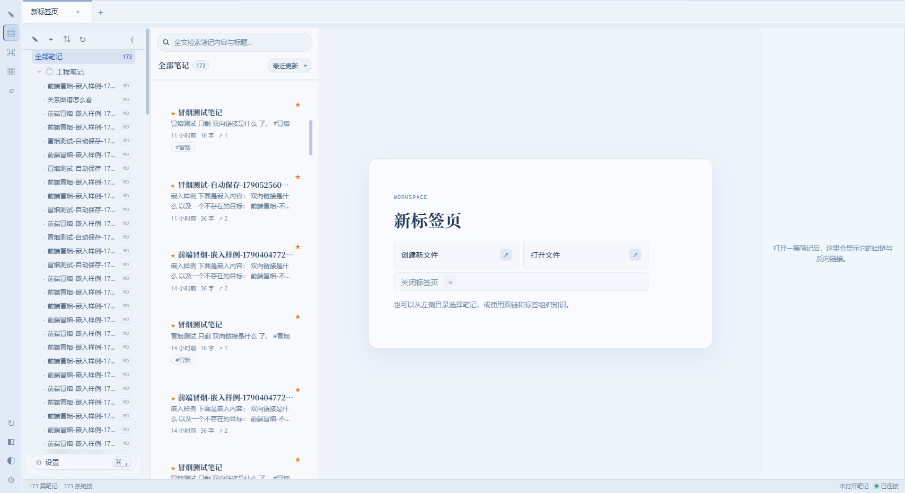
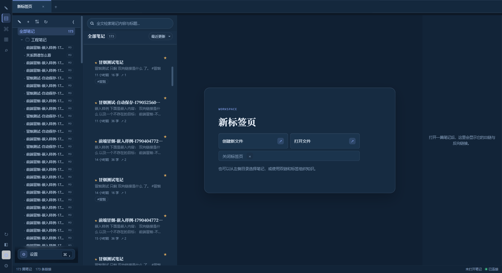
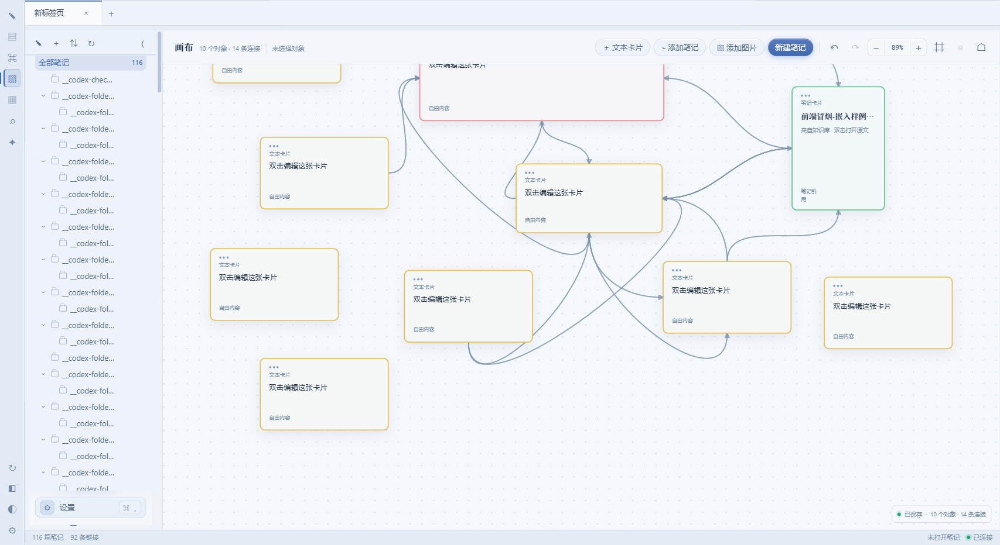
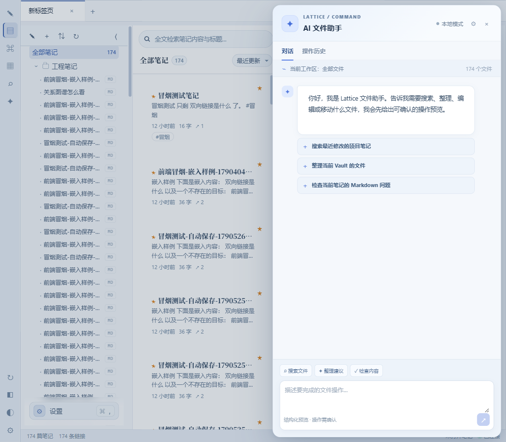
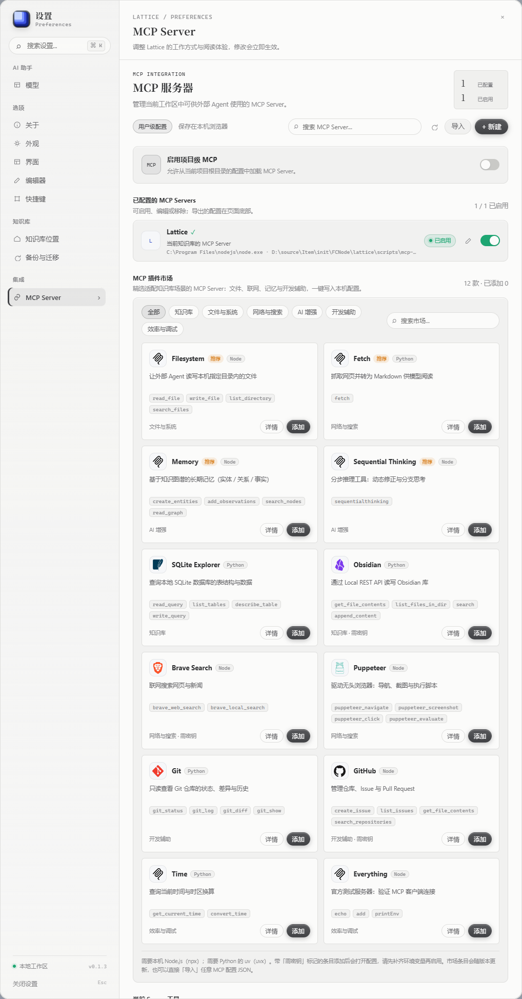

# 格物 Lattice

> 语言切换 Language: [中文](./README.zh-CN.md) | [English](./README.en.md)

一个**本地优先**的双链笔记知识库，参照 Obsidian 的核心体验实现。用户选择本地 Vault 文件夹，笔记以 Markdown 文件保存，SQLite 仅作为可重建索引。默认无需联网；配置外部模型后，只有 AI 对话会按配置发送到对应服务。

所有数据都在你自己的机器上，不需要注册、不需要联网。

---


[](../LICENSE)
[](#发行版说明)
[](../package.json)
[](https://github.com/Dawei-star/Lattice/stargazers)
[](https://github.com/Dawei-star/Lattice/issues)
[](https://github.com/Dawei-star/Lattice/commits/main)

## 网站入口

**格物 Lattice 文档站**：[在线访问](https://dawei-star.github.io/Lattice/website/lattice-docs.html) · [`website/lattice-docs.html`](../website/lattice-docs.html)
集中查看产品介绍、功能预览、隐私边界、技术构成和快速开始说明。

**格物 Lattice 下载中心**：[在线访问](https://dawei-star.github.io/Lattice/website/lattice-download.html) · [`website/lattice-download.html`](../website/lattice-download.html)
提供 Windows 安装版与绿色版的 GitHub Releases 入口；具体版本、文件名和校验信息以发布页为准。

**源码与反馈**：[`Dawei-star/Lattice`](https://github.com/Dawei-star/Lattice)

下载仓库后可以直接双击打开上述 HTML 页面；在线发布和正式安装包请以 GitHub Releases 为准。

## 界面预览

### 知识库工作区

<table>
  <tr>
    <td width="50%"></td>
    <td width="50%"></td>
  </tr>
  <tr>
    <td align="center">浅色主题</td>
    <td align="center">深色主题</td>
  </tr>
</table>

### 白板与 AI 助手

<table>
  <tr>
    <td width="50%"></td>
    <td width="50%"></td>
  </tr>
  <tr>
    <td align="center">本地白板与关系连线</td>
    <td align="center">AI 知识库助手</td>
  </tr>
</table>

### MCP 集成



## 文档

| 文档 | 面向 | 内容 |
| --- | --- | --- |
| 本文 | 开发者 / 二次开发 | 架构、技术选型、API、数据模型、测试与开发运行 |
| [`使用说明书.md`](../使用说明书.md) | 发行版使用者 | 安装启动、界面导览、笔记、白板、设置、备份迁移、升级卸载与故障排查 |

两份文档的定位不同：本文面向代码维护与二次开发，说明书面向已经安装发行版的日常使用者。
发行版安装包由发布版本直接提供，本文不重复介绍打包流程。

---

## 功能

| 能力 | 说明 |
| --- | --- |
| Markdown 编辑 | 编辑 / 分栏 / 预览三种模式，900ms 静默自动保存，滚动同步 |
| 双向链接 | `[[标题]]`、`[[标题\|别名]]`、`[[标题#小节]]`，自动解析并生成反向链接面板 |
| 嵌入引用 | 独占一行的 `![[标题]]` 会展开为内嵌卡片，支持两级嵌套并检测循环引用 |
| 关系图谱 | Canvas 手写力导向布局，按度数缩放节点，支持拖拽 / 缩放 / 点击跳转 |
| 全文检索 | SQLite FTS5 + trigram 分词，中文可做子串匹配；结果带关键词高亮 |
| Inbox 工作队列 | 快速收集临时内容，按待整理 / 整理中 / 已处理筛选，并可标记完成或归档到项目 |
| 标签 | 正文写 `#标签` 自动归类，支持 `#工程/前端` 嵌套写法 |
| 目录树 | 任意层级嵌套、就地重命名、删除后笔记自动回到「未分类」 |
| 多标签页 | 并行打开多篇笔记，支持锁定、收藏、重命名、移动，以及关闭左侧 / 右侧 / 其他标签 |
| 本地白板 | 使用 `.canvas` 文件保存文本卡片、笔记卡片、Vault 图片和卡片连接，支持四边连接点、拖拽、缩放与对齐 |
| Vault 文件浏览 | 侧栏显示 Markdown 与 Canvas 文件，可打开、移动、复制路径并通过右键菜单操作；「显示附件」开关打开后还可浏览任意文件夹中的非笔记文件 |
| 确定性文件助手 fc | `npm run fc` 本地命令（read/stat/find/grep/create/write/append/edit/copy/move/delete/mkdir/batch/undo/log）与 `GET/POST /api/files/*` 同一套核心：路径穿越 / 符号链接防护、原子写、`.fc/trash` 快照与审计、可撤销，例行文件操作不依赖模型往返 |
| AI 知识库助手 | 流式对话、带来源引用的知识库问答（FTS + 语义混合检索）、会话持久化、相关笔记推荐、Inbox 整理建议与安全归档、自然语言文件操作（任务模式可自主多轮执行并自动审计）、编辑器写作助手（润色/摘要/翻译/续写/从标题创作全文/自定义指令，流式预览）、检索调试视图、CLI 任务模式 |
| 每日摘要 | 手动生成当天修改笔记的 Journal 摘要；设置 `AI_DIGEST_HOUR` 后可按本地时区定时生成（错过自动补跑），并对同一天幂等更新 |
| MCP Server | 通过 stdio 向 Claude 等外部 Agent 暴露 `list_notes`、`search_notes`、`read_note`、`get_note_links`、`list_tags`、`get_vault_statistics`、`list_note_history`；默认只读，显式开启 `LATTICE_MCP_ALLOW_WRITES` 后才提供 `create_note`、`update_note`、`restore_note_version`，写入统一记录 MCP 审计 |
| 单篇 HTML 导出 | 从编辑区导出带 Lattice 品牌页眉、页脚、图片内联、双链可点击和嵌入展开的独立 HTML 文件 |
| Vault 备份与恢复 | 桌面版从「设置 → 备份与迁移」一键复制 Markdown、Canvas、附件、模板和历史快照到带时间戳的新目录；恢复时重新选择备份目录即可，AI API Key 不会写入备份 |
| 快速切换 | `Ctrl / Cmd + K` 按标题模糊跳转，标题不存在时一键创建；开启附件显示后结果同时包含附件 |
| 悬空链接 | 引用尚不存在的笔记时标记为悬空，一键补全 |
| 个性化设置 | 浅色 / 深色主题、背景图片、自定义主题、界面密度、字号、内容宽度与编辑器偏好 |

快捷键：`Ctrl/Cmd+K` 快速切换 · `Ctrl/Cmd+N` 新建笔记 · `Ctrl/Cmd+S` 立即保存 · `Ctrl/Cmd+E` 切换编辑/预览 · `Ctrl/Cmd+Shift+I` 收集到 Inbox

---

## 开发快速开始

普通使用者直接运行已发布的 Windows 发行版即可，无需安装 Node.js 或执行下面的开发命令。
下面内容仅供开发、调试和二次开发使用。

```bash
# 1. 安装依赖（后端 + 前端）
npm run setup

# 2. 初始化索引数据库（仅开发模式需要）
npm run db:migrate

# 3. 可选：写入一套互相关联的示例知识库
npm run db:seed

# 4. 开发模式（后端 5177，前端首选 5173；端口占用时 Vite 自动顺延）
npm run dev
```

打开终端输出的前端地址即可使用，端口空闲时通常是 <http://localhost:5173>。

### 生产模式（单进程）

```bash
npm run build     # 构建前端到 web/dist
npm start         # 后端同时托管 API 与前端静态资源
```

访问 <http://127.0.0.1:5177>。这条路径下前端与 API 同源，不涉及任何 CORS。

### 发行版说明

发行版已经提供 Windows 安装版与绿色版，普通使用者无需准备 Node.js、数据库或开发环境。
安装、首次选择 Vault、数据位置、升级和卸载方式请直接阅读 [`使用说明书.md`](../使用说明书.md)。

开发者只需要关注源码、测试和开发运行流程；发行版的具体文件名、下载地址与发布说明以对应版本
的发行包为准。

### 配置

复制 `server/.env.example` 为 `server/.env` 后按需修改。所有配置在进程启动时集中校验，
任何非法值都会让进程立即退出，而不是等到某个请求才暴露。

| 变量 | 默认值 | 说明 |
| --- | --- | --- |
| `HOST` / `PORT` | `127.0.0.1` / `5177` | API 监听地址 |
| `DB_FILE` | `./data/lattice.db` | SQLite 文件路径 |
| `VAULT_DIR` | `./data/vault` | Markdown Vault 文件夹路径 |
| `CORS_ORIGINS` | `http://localhost:5173,...` | 允许的前端来源，生产环境禁止写 `*` |
| `LOG_LEVEL` | `info` | `debug` / `info` / `warn` / `error` |
| `AUTO_MIGRATE` | `true` | 启动时自动应用未执行的迁移 |
| `WORKSPACE_ACCESS_TOKEN` | 空 | 非回环监听时必填；设置后所有 `/api` 要求 `X-Workspace-Token`，Bearer 作为 CLI 兼容回退 |
| `WORKSPACE_ACCESS_ROLE` | `editor` | 工作区令牌认证后的服务端角色：`viewer` / `editor` / `admin` |
| `AI_ACCESS_TOKEN` | 空 | 可选。在工作区认证之外，设置后 `/api/ai` 还要求 `Authorization: Bearer <token>` |
| `AI_ACCESS_ROLE` | `editor` | 令牌认证后的服务端角色：`viewer` / `editor` / `admin` |
| `LATTICE_MCP_ALLOW_WRITES` | `false` | MCP 默认只读；仅设置为 `true`、`1` 或 `yes` 时暴露写入工具 |
| `AI_SETTINGS_ENCRYPTION_KEY` | 空 | 可选。独立服务使用 32 字节 hex/base64 密钥加密 SQLite 中的 AI 配置；桌面版自动使用 Windows `safeStorage` |
| `AI_CHAT_TIMEOUT_MS` | `120000` | AI 上游调用超时（连通性测试固定 20 秒） |
| `AI_ALLOW_PRIVATE_ENDPOINTS` | `false` | 默认拒绝指向内网 / 回环地址的 AI endpoint（SSRF 防护）；本地模型用户可显式开启 |
| `AI_DIGEST_HOUR` | 空 | 可选。`0`-`23` 的本地小时；设置后服务端自动生成 `Journal/每日摘要 YYYY-MM-DD.md` |
| `WEB_DIST_DIR` | `../web/dist` | 前端产物目录；桌面端打包后指向解包目录 |

外部模型（对话与 embedding）配置在模型管理中心填写，保存后自动同步到本机服务端（SQLite `ai_settings` 表，桌面版密文存储），
聊天、语义索引管道与 CLI 共用同一份配置；浏览器本地只保留界面缓存。CLI 使用同一套 API，
可通过 `LATTICE_AI_ACCESS_TOKEN` 传递工作区令牌；服务端令牌启用后，角色以服务端配置为准。浏览器端会从 AI 设置中的访问令牌自动发送 `X-Workspace-Token`。
语义索引在「设置 → 模型管理」配置 embedding 模型后自动增量进行；启用云端 embedding 时笔记分块内容会发往该服务商。

```bash
npm run ai -- chat "搜索项目笔记"
npm run ai -- preview --file plan.json
npm run ai -- execute --confirm --file plan.json
npm run ai -- history --limit 40
```

### MCP Server

```bash
npm run setup       # 首次安装也会安装 MCP 依赖
npm run mcp         # 以 stdio 启动 MCP Server
npm run test:mcp    # 运行 MCP 协议与读写 e2e
```

Claude Desktop 等客户端需要把 `scripts/mcp-server/server.mjs` 配置为 stdio command，并通过 `DB_FILE` / `VAULT_DIR` 指向与 Lattice 相同的数据目录。MCP 默认只读；如需允许外部 Agent 修改 Vault，在配置的 `env` 中显式加入 `LATTICE_MCP_ALLOW_WRITES: "true"`。写入工具只在该开关开启时注册，并统一记录 MCP 审计。

---

## 技术选型与权衡

| 决策 | 选择 | 理由 |
| --- | --- | --- |
| 数据库驱动 | Node 内置 `node:sqlite` | 数据库层零原生依赖，免去 Windows 上编译 better-sqlite3 的麻烦 |
| 中文检索 | FTS5 `trigram` 分词器 | 默认的 `unicode61` 会把整串汉字当成一个词，搜「知识」匹配不到「知识管理」；trigram 按 3 字符滑窗建索引，天然支持中文子串匹配 |
| 短词检索 | LIKE 兜底 | trigram 需要至少 3 个字符，两字查询（如「笔记」）必须回退；FTS 空结果时也会用 LIKE 复核一遍，避免分词边界漏召回 |
| 图谱渲染 | 原生 Canvas，不用 d3 | 需求只有画点、画线、拖拽、缩放，一个图表库的体积与抽象成本高于收益 |
| Markdown 消毒 | 自研白名单消毒器 | 正文可能来自剪藏网页，直接 `innerHTML` 是一条真实的 XSS 路径。用 DOMParser 解析后按白名单裁剪，省掉一个依赖 |
| 实时协作 | 不实现 | 单机单用户场景没有协作需求，用自动保存 + 本地状态足够，不做过度设计 |
| API 认证 | 工作区令牌 + 可选 AI 二次令牌 | 回环地址可保持单机本地模式；非回环监听必须配置 `WORKSPACE_ACCESS_TOKEN`，`AI_ACCESS_TOKEN` 可额外保护 AI 路由，角色均由服务端固定 |
| 前端路由 | 不用 react-router | 视图内部状态即可，少一个依赖 |

---

## 工程结构

```
lattice/
├── server/                          后端（Express 5 + node:sqlite）
│   ├── src/
│   │   ├── config/                  环境变量集中校验，启动即 fail fast
│   │   ├── db/
│   │   │   ├── index.js             连接池、WAL、外键、事务包装器
│   │   │   ├── migrate.js           迁移执行器（校验和漂移检测）
│   │   │   └── seed.js              幂等的示例数据（可编程调用 + CLI 入口）
│   │   ├── migrations/              版本化 SQL 迁移
│   │   ├── lib/                     错误体系、结构化日志、Markdown 语义解析
│   │   ├── middleware/              请求 ID、访问日志、CORS、安全头、校验、错误处理、工作区认证
│   │   ├── modules/                 按功能组织，每个模块四层
│   │   │   └── notes|folders|files|links|tags|search|graph|canvas|vault|workspace|meta|health/
│   │   │       ├── *.routes.js      路由 + zod 边界校验
│   │   │       ├── *.controller.js  只做请求/响应转换
│   │   │       ├── *.service.js     业务规则与事务编排
│   │   │       └── *.repository.js  只做 SQL
│   │   ├── vault/                   Vault 读写适配、索引、watcher 与路径净化
│   │   ├── app.js                   中间件装配（顺序即安全边界）
│   │   └── index.js                 启动、迁移、优雅停机
│   └── test/                        纯函数单元测试
├── web/                             前端（React 18 + Vite 5）
│   ├── public/theme-init.js         首屏定主题（必须是同源外链，见下方 CSP 说明）
│   └── src/
│       ├── api/                     类型化 HTTP 客户端 + 资源访问层
│       ├── hooks/                   知识库中心状态、防抖、轻提示
│       ├── lib/                     Markdown 管线、HTML 消毒、力导向布局、格式化
│       ├── components/              侧栏 / 列表 / 编辑区 / 关系面板 / 图谱 / 白板 / 切换器
│       ├── settings/                设置窗口与模型管理中心
│       └── styles.css               设计令牌 + 双主题
├── desktop/                         Electron 桌面壳（main / preload / backend / 菜单）
├── scripts/                         开发 / 冒烟脚本、MCP server 与 fc 确定性文件助手
└── website/                         文档站、下载中心与用户指南
```

### 应用图标

标记是「晶面层叠」：四层圆角方块沿 45° 逐层错位、逐层收缩，每层自带一条向下的
厚度边 —— 八块平色堆出体积，不描边、不用渐变。`desktop/build/make-icon.py` 是
唯一事实源，`web/index.html` 的 favicon 是同一套几何的 ≤24px 简化版，
**改标记时两处要一起改**。

脚本产出**两份** `.ico`，别搞混：

| 产物 | 用途 | 引用它的地方 |
|---|---|---|
| `build/icon.ico` | 打包时写进 exe 资源段（文件管理器 / 快捷方式 / 安装向导） | `electron-builder.yml` 的 `win.icon` |
| `assets/icon.ico` | 运行时窗口与任务栏图标 | `src/main.js` 的 `ICON_PATH` |

为什么必须两份：`build/` 是 electron-builder 的 `buildResources` 目录，
**不会被拷进应用**。只留一份的话，开发模式（跑的是 `electron.exe`）会顶着
Electron 的默认图标，直接跑 `release/win-unpacked/lattice.exe` 也未必对。
两份由脚本用 `copyfile` 生成，字节完全一致。

发布版本的窗口、任务栏与安装入口共用这套图标资源；修改图标后应随下一次发行版本一起更新。

三点容易踩：

- **色阶要在 OKLab 里按明度等距生成，不要手工挑。** 八个色手工挑必然出现某两层
  挤在一起、另两层拉太开，缩小后读成「两组两层」。推导规则与参数见
  `build/concepts-v6/palette-oklch.py`，零依赖、可直接跑。
- **≤24px 必须换简化几何。** 完整几何每层的 L 形露出只有 66 单位（16px 下 1.0px），
  缩下去必糊。简化版减到三层并拉大明度跨度，保住「错位层叠」这个识别特征。
- 交付时几何整体按 `MARK_SCALE = 0.92` 缩放。错位会让左上角与右下角分别顶到更外，
  按 1.0 交付显得「顶格」。这个系数只做整体缩放，几何一字不动。

### 一个容易踩的坑：CSP 会拦掉自己的内联脚本

生产模式下后端会给 HTML 施加 `script-src 'self'` 的 CSP（`server/src/app.js`），
因此 `index.html` 里**不能**写内联 `<script>` —— 会被静默拦掉。首屏定主题那段逻辑
就必须放在 `web/public/theme-init.js` 这种同源外链文件里，并且不能加 `type="module"`
（module 脚本延迟执行，赶不上首次绘制，反闪烁会失效）。开发模式没有 CSP，看不到这个问题。

### 桌面端的环境适配：两级崩溃自愈

受限环境（虚拟机、远程桌面会话、带主动防御的安全软件）里 Chromium 的**子进程沙箱**
可能无法初始化：GPU 进程反复崩溃，最终以
`FATAL:gpu_data_manager_impl_private.cc  GPU process isn't usable. Goodbye.`
直接终结整个应用 —— 用户看到的现象就是「双击了，什么都没发生」。
`desktop/src/main.js` 为此做了两级兜底：

1. **GPU 自愈**：同一次启动内 GPU 进程崩溃达 3 次即落下标记文件，下次启动自动追加
   `--disable-gpu-sandbox`。只作用于 GPU 进程，主进程与内嵌后端不受影响；
   驱动正常的机器永远不会触发。
2. **渲染崩溃提示**：界面进程连续崩溃 3 次后弹窗说明成因并给出日志路径，
   而不是留一片白屏让用户干等。

另外三个只在桌面端成立的约束：

- **窗口底色要跟随主题**：`BrowserWindow` 的 `backgroundColor` 在页面加载完成后按
  `document.documentElement.dataset.theme` 回写，否则深色主题下拖动窗口会闪白边。
- **外链必须外跳**：`will-navigate` / `setWindowOpenHandler` 把非本站 URL 交给系统浏览器，
  防止把应用窗口本身导航走。
- **环境变量必须早于动态 import**：`server/src/config` 在**首次 import 时**读取并冻结
  `process.env`，所以 `DB_FILE` / `WEB_DIST_DIR` / `PORT` 都必须在 `import` 之前设置好，
  顺序错了会静默用上默认值。

### 分层约定

一次「保存笔记」实际上要保证三件事同时成立：笔记本体落库、标签关联与正文一致、出链与正文一致。
三者必须原子完成，因此统一收敛在 `notes.service` 的一个事务里 —— 控制器不碰 SQL，
服务层不依赖 `req` / `res`，仓储层只负责查询。这样业务规则可以被后续的定时任务或脚本直接复用。

链接与标签都是**正文派生数据**，不是独立事实。因此每次保存都按其正文全量重建，
而不是做增量 diff —— 后者引入的一致性风险远高于它的性能收益。

### 错误契约

所有失败响应统一为：

```json
{
  "error": {
    "code": "VALIDATION_ERROR",
    "message": "请求参数校验未通过",
    "details": [{ "in": "body", "field": "name", "message": "目录名不能为空" }],
    "requestId": "8f3a..."
  }
}
```

`requestId` 同时写在响应头和日志里，可直接串联排查。
5xx 一律不外泄堆栈与内部细节，只返回通用文案。

---

## API

| 方法 | 路径 | 说明 |
| --- | --- | --- |
| `GET` | `/health` `/ready` | 存活 / 就绪探针 |
| `GET` | `/api/notes` | 列表，支持 `folderId`（`__none__` 表示未分类）、`tagId`、`inboxStatus`（`all` / `captured` / `processing` / `processed`）、`sort`、`limit`、`offset` |
| `GET` | `/api/notes/index` | 全量轻量索引（供快速切换与双链解析） |
| `GET` | `/api/notes/:id` | 详情，含标签、出链、反向链接与 `contentHash` |
| `POST` | `/api/notes` | 新建，可带客户端 UUID 以保证重试幂等 |
| `PATCH` | `/api/notes/:id` | 局部更新（`title` / `content` / `folderId` / `isPinned` / `properties` / `expectedHash`，版本不匹配返回 409） |
| `DELETE` | `/api/notes/:id` | 删除，幂等 |
| `GET` | `/api/notes/templates` | 列出 Vault `_templates/` 下的 Markdown 模板 |
| `POST` | `/api/notes/from-template` | 按模板创建笔记，支持 `{{date}}` / `{{time}}` / `{{title}}` |
| `POST` | `/api/notes/daily` | 创建幂等的 `Daily/YYYY-MM-DD.md` 每日笔记 |
| `GET` | `/api/notes/:id/history` 等 | 查看、预览和恢复笔记版本历史（每篇最多保留 200 个快照） |
| `GET` `POST` `PATCH` `DELETE` | `/api/folders` | 目录树与增删改 |
| `GET` `POST` | `/api/files` | 确定性文件助手：read / find / grep / preview / execute / undo / log（execute 需确认，viewer 不可执行） |
| `GET` `DELETE` | `/api/tags` | 标签列表（带引用数）与删除 |
| `GET` `PUT` `PATCH` | `/api/canvas` | 读取、保存和移动 Vault 中的 `.canvas` 白板文件 |
| `GET` | `/api/canvas/files` | 列出 Vault 中的白板文件 |
| `GET` | `/api/vault/files` | 列举 Vault 中除笔记 / 画布外的所有非笔记文件（附件显示开关数据源） |
| `GET` | `/api/vault/assets` | 列出可在白板中引用的图片资源 |
| `GET` | `/api/vault/asset?path=` | 读取 Vault 中的图片资源 |
| `GET` `POST` `DELETE` | `/api/vault/attachments` 等 | 附件列举、上传、读取、删除、引用检查和孤儿清理 |
| `POST` | `/api/workspace/sse-ticket` | 用长期令牌换取 30 秒一次性 SSE 票据（命中即核销） |
| `GET` | `/api/search?q=` | 全文检索；可附带 `inboxStatus` 限定 Inbox 状态，响应 `meta.strategy` 说明用了 `fts` 还是 `like` |
| `GET` | `/api/graph` | 图谱节点、边、悬空引用与统计 |
| `GET` | `/api/meta/overview` | 知识库总览统计 |
| `POST` | `/api/ai/chat` | 对话（非流式，CLI / 兼容入口），返回带来源引用的回复、建议与结构化操作 |
| `POST` | `/api/ai/chat/stream` | 流式对话（SSE）：`meta` → `delta`… → `done`/`error` |
| `GET/PUT` | `/api/ai/settings` | 读取 / 保存服务端模型配置（对话模型 + embedding） |
| `GET/POST` | `/api/ai/sessions` 等 | 会话列表、创建、消息读取、重命名、删除 |
| `GET` | `/api/ai/index/status` · `POST /api/ai/index/reindex` | 语义索引状态与全量重建 |
| `GET` | `/api/ai/related?noteId=` | 相关笔记推荐（语义，需 embedding 配置） |
| `POST` | `/api/ai/retrieval/preview` | 检索调试视图：关键词/语义双路命中与融合结果 |
| `POST` | `/api/ai/operations/preview` | 预览文件操作、存在性和风险；写操作标记为需要确认 |
| `POST` | `/api/ai/operations/execute` | 在角色权限和显式确认通过后执行 `read/create/update/delete/move/copy/archive`；`archive` 只归档 `type: inbox` 文件并移除 Inbox 标记 |
| `GET` | `/api/ai/history` | 查看 AI/CLI 文件操作审计历史 |
| `GET` | `/api/update/check` | 服务端代理查询 GitHub Releases（桌面端检查更新） |

---

## 数据模型

```
folders ──┬─< folders (parent_id, 自引用)
          └─< notes (folder_id, ON DELETE SET NULL)

notes ──┬─< note_tags >── tags
        ├─< links (source_note_id, ON DELETE CASCADE)
        └─< links (target_note_id, ON DELETE SET NULL → 变回悬空链接)
        └── notes_fts (FTS5 虚拟表，由触发器保持同步)
```

`links.target_note_id` 为 `NULL` 表示**悬空链接**：被 `[[引用]]` 但目标笔记还不存在。
删除被引用的笔记时，指向它的链接会自动退回悬空状态，而不是被整条抹掉 —— 这样引用关系不会凭空消失。

迁移文件记录 sha256 校验和，历史迁移被改动时会直接报错，强制「只新增、不再改写」。

---

## 测试

```bash
npm test            # 后端单元测试（Markdown 与 AI 操作边界，36 项）
npm run test:api    # 接口冒烟测试，需后端已启动（68 项）
npm run test:web    # 前端渲染冒烟测试，需后端已启动（49 项）
npm run test:mcp    # MCP stdio 协议与笔记读写 e2e
npm run test:fc     # fc 确定性文件助手单元测试
npm run test:fc:cli # fc CLI 冒烟
npm --prefix desktop test  # Electron 桌面壳与打包契约测试
npm run verify      # 依次执行 fc → server → web → mcp-server → desktop 全套
```

三层测试各自负责不同的事：

1. **单元测试** —— 纯函数的边界行为，跑得最快，覆盖标签 / 双链 / 标题推断 / 文件助手的各种边角情况
2. **接口冒烟** —— 用 `fetch` 打真实端点，验证状态码、错误契约、CORS 白名单、写操作幂等性
3. **前端渲染冒烟** —— 把真实的 React 组件树打包后在 jsdom 中挂载，连真实后端，验证
   「渲染 → 取数 → 点击 → 自动保存 → 切视图」这条完整链路，并断言控制台无未处理异常

前端测试会临时创建一篇样例笔记来验证嵌入渲染，**每次运行前先清理上次残留**，跑完自动删除，
因此不会污染你的真实数据。

---

## 已知限制与后续方向

当前实现刻意划定了边界，以下是明确未做或仍需增强的部分：

- **静态站点仍是单篇导出**：单篇 HTML 已支持图片内联、双链和嵌入展开；完整 Vault 批量导出、导航页和资源目录尚未实现
- **历史保留按天归并未实现**：版本快照已按每篇 200 个上限自动清理、内容相同不重复写，但高频编辑下的按天归并尚未落地
- **fc 尚无 GUI diff 组件**：命令行与 API 已可返回 `preview.diff`，界面内的差异渲染尚未提供
- **无实时协作**：单机单用户，未引入 WebSocket / CRDT
- **图谱规模**：力导向是 O(n²)，数百到数千节点流畅；上万节点需要换 Barnes-Hut 近似
- **`node:sqlite` 的稳定性**：它仍被 Node 标记为实验特性（虽已可直接使用）。若追求绝对稳定，
  可换 `better-sqlite3`，接口几乎一一对应，迁移成本很低
- **移动端**：窄屏已做响应式降级，但还不是 PWA

下一步建议按此顺序推进：GUI diff 与批量计划 → 完整静态站点导出 → PWA。
